ChartCam
========

[](https://opensource.org/licenses/Apache-2.0)


[](https://github.com/SamuelMarks/chart-cam/actions/workflows/coverage.yml)
[](https://github.com/SamuelMarks/chart-cam/actions/workflows/deploy.yml)

> Open-source, decentralized, offline-first, and FHIR/DICOM-native. Built for Harvard clinicians, global health teams, and clinical researchers to rapidly capture encrypted multimodal media, run bespoke clinical studies, and inspect medical datasets on the go.

ChartCam is a fully open-source, decentralized clinical data capture, triage, and research platform engineered for modern healthcare and high-friction medical environments. Originally developed in collaboration with Google-sponsored clinical researchers at Harvard Medical School’s Mass General Hospital (Mass Eye and Ear Infirmary), ChartCam brings rigorous, privacy-first clinical documentation directly to the point of care.

Far beyond a standard clinical camera, ChartCam is a complete engine designed to democratize medical studies and clinical intake. It empowers clinicians, academics, field medics, and investigators to effortlessly build, share, and deploy dynamic questionnaires to run their own observational studies or clinical triage workflows without depending on centralized servers, vulnerable cloud middleware, or active internet connectivity.

---

### 🎯 Who is ChartCam For?

* **Clinical Researchers & Academic Investigators:** Design, duplicate, and deploy custom clinical trial questionnaires in seconds. Collect structured, protocolized data on-device, export encrypted datasets, or export de-identified DICOM cohorts for multi-center research.
* **Specialist Clinicians & Outpatient Practices:**
  * **Dermatology:** Calibrated photography with real-time levelers and standardized Fitzpatrick skin phototyping swatches.
  * **Wound Care, Orthopedics & Trauma:** Interactive anatomical body-map pin drop to precisely log lesion or injury coordinates over longitudinal visits.
  * **Pain Management & Palliative Care:** Integrated Wong-Baker FACES® and Visual Analog Scale (VAS) pain assessment sliders.
* **Global Health, Humanitarian & Rural Field Teams:** 100% offline functionality. Capture high-fidelity photos, record clinical videos, dictate voice memos, and manage patient encounters in remote or low-connectivity environments with zero network leak.
* **Medical Educators & Residents:** Master standardized, orthogonal clinical photography and structured patient documentation with built-in interactive demo modes and onboarding tutorials.

---

### 🛡️ Core Pillars

* **True Decentralization & Data Sovereignty:** ChartCam operates strictly **offline-first**. Patient data is isolated to the application sandbox—never polluting public galleries (e.g., Google Photos, Apple Photos)—and encrypted at rest using platform-native hardware enclaves (Android Keystore, iOS Keychain, SQLCipher, WebCrypto).
* **Native FHIR R4 & DICOM Part 10 Interoperability:** Eliminates data silos. Captured encounters, media, and questionnaires are structured natively as HL7 FHIR resources (`Patient`, `Encounter`, `DocumentReference`, `Media`, `Questionnaire`, `QuestionnaireResponse`, `Provenance`). Encounters and media can also be exported directly as PACS-compliant DICOM (`.dcm`) Part 10 files with HIPAA-compliant anonymization toggles.
* **Multimodal Clinical Capture:** Go beyond static images with hardware-accelerated photo capture, clinical leveler overlays, high-definition video recording (for gait, tremor, and dynamic assessments), and voice memo dictation attached directly to encounters.
* **Advanced SDC Form Builder & Engine:** Powered by the HL7 FHIR Structured Data Capture (SDC) implementation guide. Features visual widgets, conditional logic (`enableWhen`), dynamic repeating question groups (`repeats = true`), and arithmetic/logical calculated expressions (e.g., auto-calculating BMI).
* **Robust Hardware Privacy & Inactivity Lockout:** Incorporates platform-level visual shields (window `FLAG_SECURE` on Android, scene blur on iOS, and window focus tracking on Desktop/Web) to block sensitive data from OS task switchers, alongside automatic session timeouts.
* **Global Localization & Accessibility:** Available in English, Spanish, Japanese, Hebrew (complete Right-to-Left RTL mirroring), and Traditional Chinese (with dedicated vertical column 直書 / 豎排 support). Screen-reader optimized with 100% doc and test coverage.

**Keywords:** `open-source, fhir, dicom, pacs, clinical, research, harvard, mgh, decentralized, encrypted, offline-first, questionnaire, sdc, ehr, medical`

## Screenshots

<div align="center">
  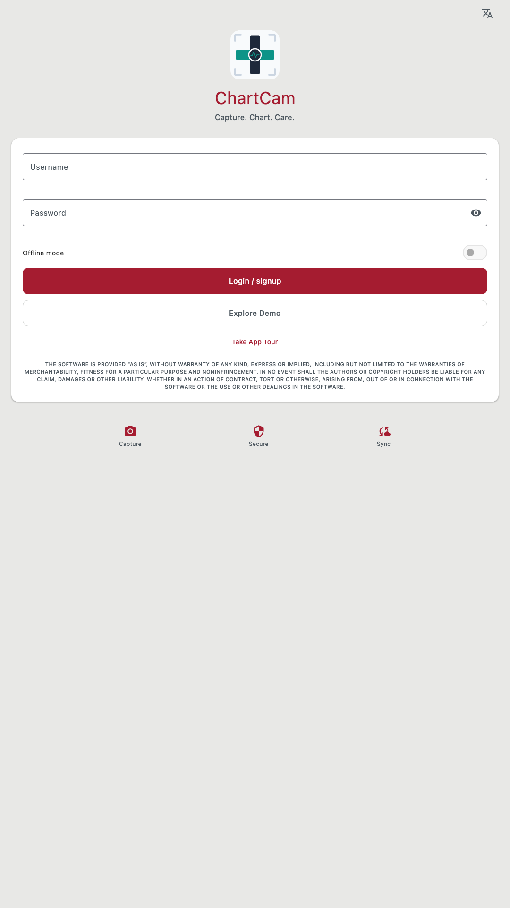
  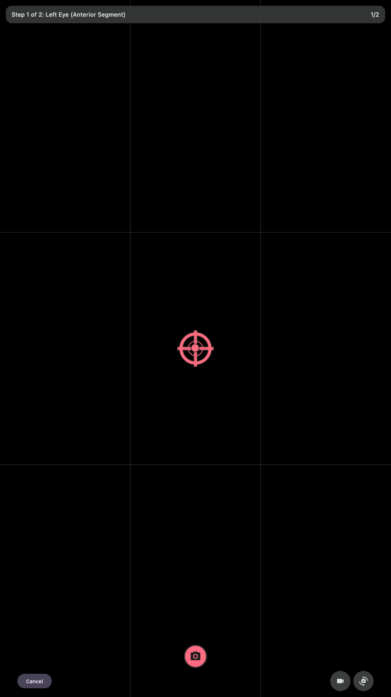
  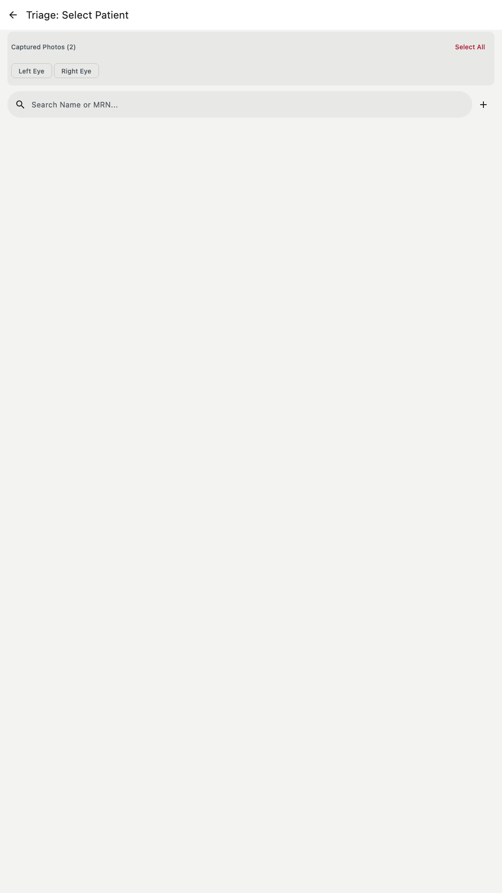
  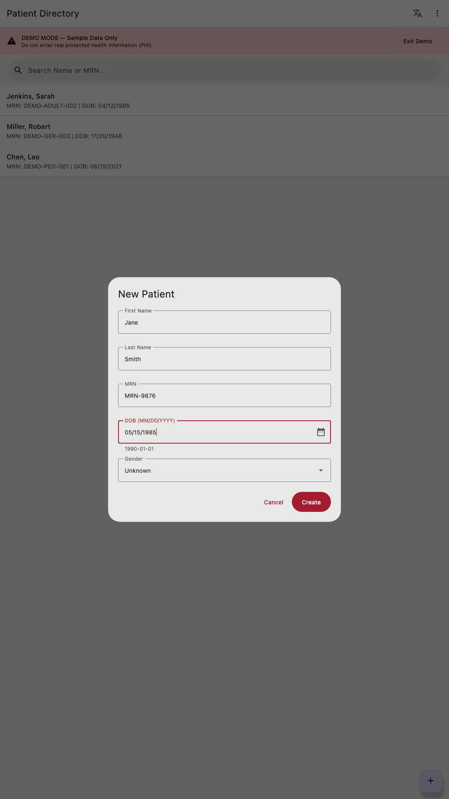
  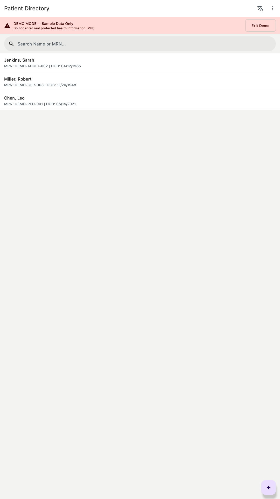
  <br/><br/>
  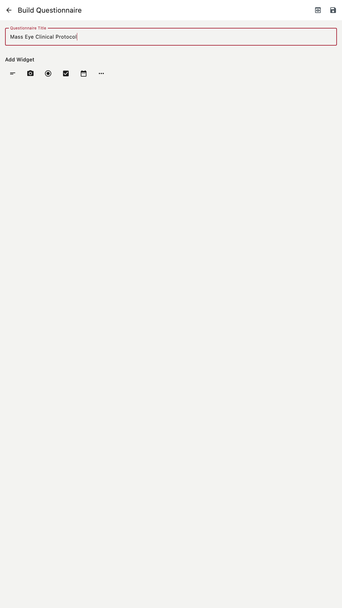
  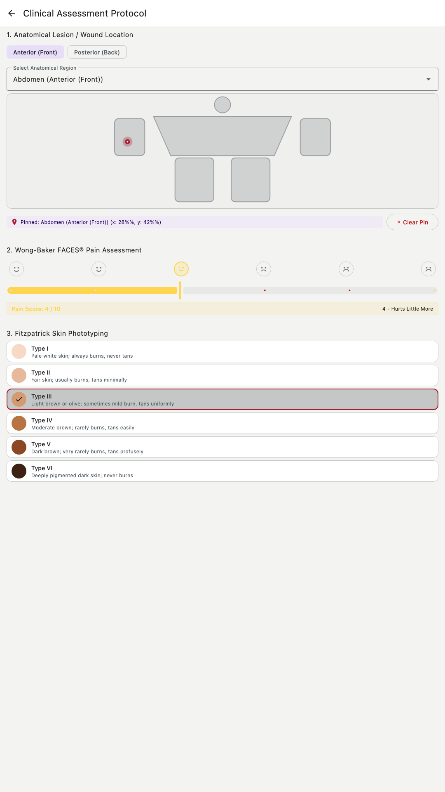
  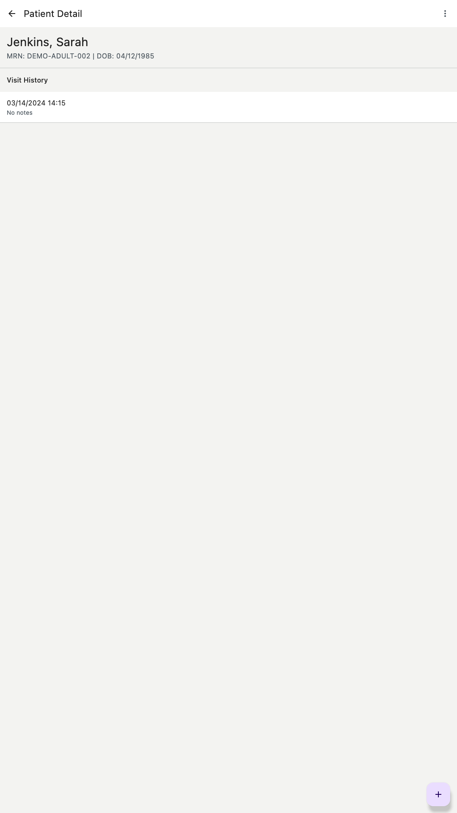
  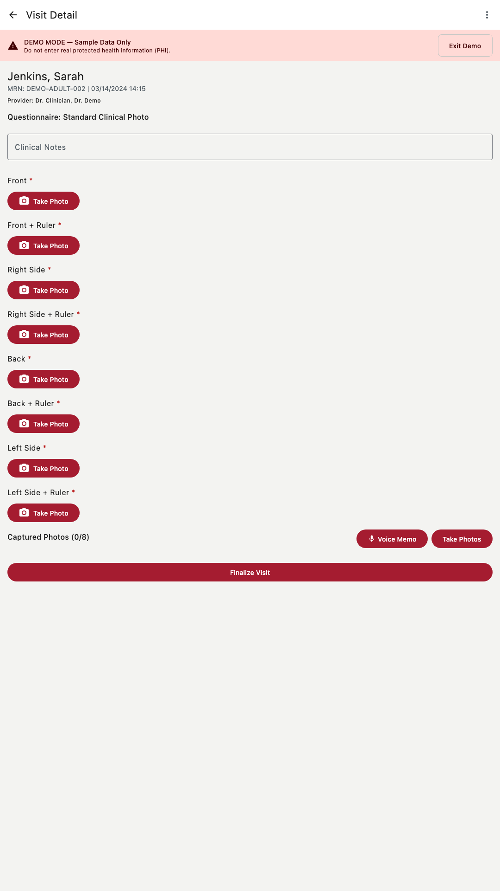
  <br/><br/>
  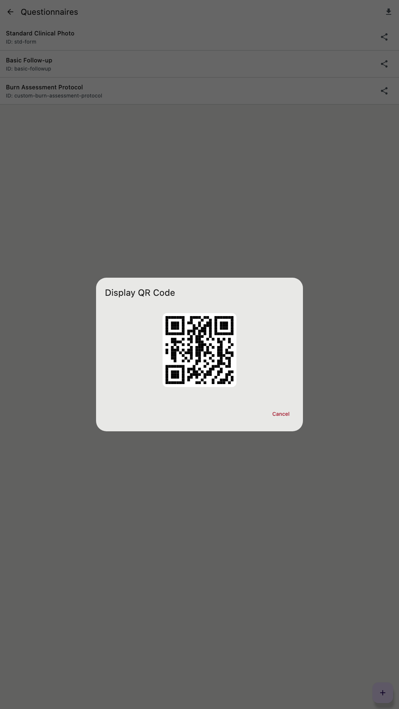
  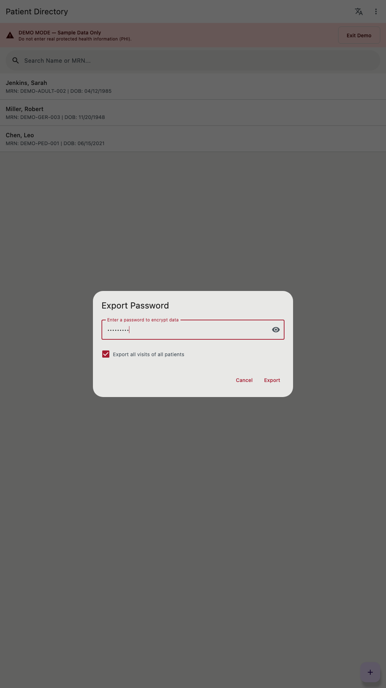
  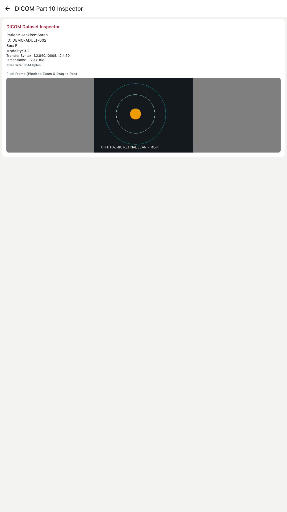
  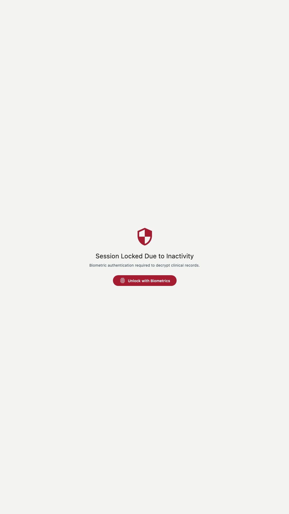
  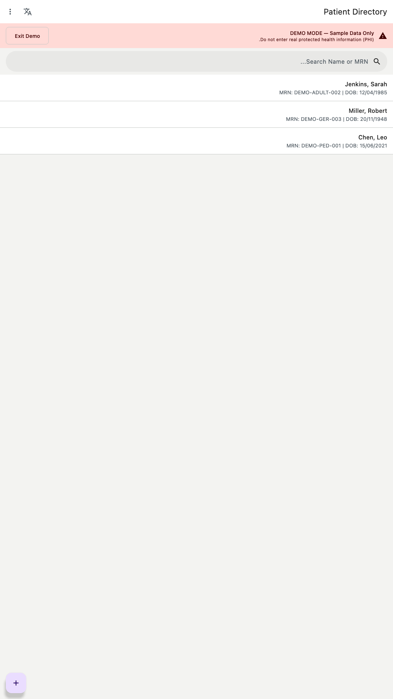
</div>

---

## 📖 Documentation Directory

To maintain focus and clarity across technical domains, detailed guides are available in our documentation suite:

* **[Usage Guide (`USAGE.md`)](USAGE.md)**: Operational guide covering dual clinical workflows (Snap-First vs. Protocol-First), triage batch actions, SDC form builder usage, DICOM inspection, and encrypted dataset migration.
* **[Release Guide (`HOW_TO_RELEASE.md`)](HOW_TO_RELEASE.md)**: Standard Operating Procedures (SOPs) for building, signing, and deploying to the **Google Play Store** and **Apple App Store**.
* **[CLI Upgrade & Migration Guide (`UPGRADE_ANDROID_VIA_CLI.md`)](UPGRADE_ANDROID_VIA_CLI.md)**: Procedures for upgrading Android builds via ADB and migrating patient databases across conflicting installations.
* **[Site Deployment & Static Portal (`DEPLOY.md`)](DEPLOY.md)**: Automated guide for building the Wasm web app, Dokka API documentation, and static markdown documentation portal.
* **[App Encryption & Export Compliance (`docs/APP_ENCRYPTION.md`)](docs/APP_ENCRYPTION.md)**: Technical breakdown of AES-256-GCM and bundled Argon2id (RFC 9106) key derivation for Apple App Store export compliance.
* **[FHIR Forms Architecture (`docs/FORMS_ARCHITECTURE.md`)](docs/FORMS_ARCHITECTURE.md)**: Technical design of the SDC Form Builder, dynamic recursive renderer, calculated expressions, and custom visual controls.
* **[Internationalization & Typography (`docs/INTERNATIONALIZATION.md`)](docs/INTERNATIONALIZATION.md)**: Architecture for multi-language support, RTL script mirroring, and Traditional Chinese vertical column writing (直書 / 豎排).
* **[Accessibility Standards (`docs/ACCESSIBILITY.md`)](docs/ACCESSIBILITY.md)**: Screen-reader semantic labels, live regions for camera levelers, and scalable typography.
* **[Validation & Terminology Profiles (`docs/VALIDATION_PROFILES.md`)](docs/VALIDATION_PROFILES.md)**: Resource constraints and LOINC/SNOMED CT terminology mappings.
* **[Navigation Architecture (`docs/NAVIGATION.md`)](docs/NAVIGATION.md)**: Type-safe Compose routing logic, state machines, and backstack behaviors.

---

## 🏥 Healthcare Interoperability: FHIR R4 & DICOM Part 10

ChartCam treats regulatory compliance and open standards as primary requirements.

### Fast Healthcare Interoperability Resources (HL7 FHIR R4)
* **Patient & Encounter Resources:** Every clinical interaction is strictly linked using standard `Patient` and `Encounter` resources with unique local identifiers and MRNs.
* **DocumentReference & Media:** Captured images, videos, and voice memos are encapsulated within `DocumentReference` resources containing rich metadata: authoring practitioner, capture timestamp, MIME types, and anatomical codification (SNOMED CT / LOINC).
* **Questionnaire & QuestionnaireResponse:** Dynamic study protocols and clinical forms map directly to standard FHIR `Questionnaire` and `QuestionnaireResponse` resources.
* **Security & Provenance:** Patient consent and data provenance are managed using `Consent` and `Provenance` resources to establish an auditable, immutable trail of clinical actions.

### DICOM Part 10 & PACS Compatibility
* **DICOM Part 10 Export:** Encapsulate clinical encounters and media into standard `.dcm` files with valid Patient, Study, Series, and Equipment modules.
* **HIPAA Anonymization:** Includes an interactive anonymization toggle to scrub patient names and identifiers when exporting files for research studies.
* **Built-in DICOM Inspector:** A local viewer supporting pixel raster rendering, interactive pan and pinch-to-zoom (up to 5x), DICOM tag metadata inspection, and encapsulated PDF extraction/viewing.

---

## ✨ Features & Tech Stack

ChartCam leverages modern Android and Kotlin Multiplatform (KMP) best practices:

* **UI**: [Compose Multiplatform](https://www.jetbrains.com/lp/compose-multiplatform/) (100% shared UI layer across all platforms).
* **Architecture**: Unidirectional Data Flow (UDF) and MVVM based on Clean Architecture principles.
* **Interoperability**: Native HL7 FHIR R4 JSON serialization and DICOM Part 10 reader/writer.
* **Local Data**: [SQLDelight](https://cashapp.github.io/sqldelight/) with SQLCipher hardware encryption.
* **Security**: Platform-specific encrypted storage modules (Android Keystore / EncryptedSharedPreferences, iOS Keychain, Argon2id C-interop, WebCrypto).
* **Hardware Interop**: Native camera, sensor, video, and audio integrations via `expect/actual` paradigms.
* **CI/CD**: Fastlane automated testing, linting, code signing, and continuous delivery.

### Feature Availability Matrix

While the **Business Logic (FHIR, Auth, ViewModels)** and **UI (Compose)** are 100% shared, hardware-specific capabilities are implemented natively via `expect/actual` bindings:

| Feature                          |      🤖 Android       |       🍎 iOS        |   🖥️ Desktop (JVM)    |   🌐 Web (JS/Wasm)    | Source Location         |
|:---------------------------------|:---------------------:|:-------------------:|:----------------------:|:---------------------:|:------------------------|
| **UI Rendering**                 |          ✅           |         ✅          |           ✅           |          ✅           | `commonMain/ui`         |
| **Navigation**                   |          ✅           |         ✅          |           ✅           |          ✅           | `commonMain/navigation` |
| **Local Auth & Argon2id**        |          ✅           |         ✅          |           ✅           |          ✅           | `commonMain/repository` |
| **Biometric Unlock**             |  ✅ (BiometricPrompt) | ✅ (FaceID/TouchID) |    ⚠️ (PIN/Password)   |   ⚠️ (PIN/Password)   | `platform/.../storage`  |
| **Secure Storage**               |  ✅ (EncryptedPrefs)  |    ✅ (Keychain)    | ✅ (AES EncryptedFile) |  ✅ (WebCrypto / IDB) | `platform/.../storage`  |
| **Database (SQL & Cipher)**      |   ✅ (AndroidDriver)  |  ✅ (Native/Cipher) |   ✅ (JDBC / Cipher)   |  ✅ (WebWorkerDriver) | `platform/.../database` |
| **Camera Preview & Leveler**     |     ✅ (CameraX)      |  ✅ (AVFoundation)  |   ✅ (Sarxos Webcam)   |   ✅ (HTML5 Video)    | `platform/.../camera`   |
| **Photo Capture**                |          ✅           |         ✅          |   ✅ (Sarxos Webcam)   |   ✅ (HTML5 Canvas)   | `platform/.../camera`   |
| **Video Recording**              |  ✅ (CameraX Video)   |  ✅ (AVFoundation)  |   ⚠️ (Pattern Stream)  |  ✅ (MediaRecorder)   | `platform/.../camera`   |
| **Camera Lens Switching (Flip)** |  ✅ (CameraSelector)  |  ✅ (AVCaptureDev)  |   ✅ (Webcam Cycling)  |   ✅ (facingMode)     | `platform/.../camera`   |
| **Audio Dictation / Memos**      |    ✅ (MediaRecorder) |  ✅ (AVAudioRecord) |    ✅ (Java Sound)     |  ✅ (MediaStream/Rec) | `platform/.../media`    |
| **RMS Audio Amplitude Meter**   |          ✅           |         ✅          |           ✅           |          ✅           | `platform/.../media`    |
| **Questionnaire QR Scanner**     |  ✅ (CameraX/ML Kit)  |  ✅ (AVFoundation)  |       ✅ (ZXing)       | ✅ (BarcodeDetect/Canv)| `platform/.../camera`   |
| **ISO/IEC 18004 QR P2P Sharing** |          ✅           |         ✅          |           ✅           |          ✅           | `commonMain/utils/qr`   |
| **Native System File Pickers**   |    ✅ (Android SAF)   | ✅ (UIDocumentPick) |  ✅ (AWT FileDialog)   |   ✅ (DOM File Input) | `platform/.../utils`    |
| **DICOM Inspector & Export**     |          ✅           |         ✅          |           ✅           |          ✅           | `commonMain/dicom`      |
| **Encrypted Dataset Backup**     |          ✅           |         ✅          |           ✅           |          ✅           | `commonMain/repository` |
| **Selective Import & Merge**     |          ✅           |         ✅          |           ✅           |          ✅           | `commonMain/repository` |
| **Sensors (Clinical Leveler)**   |  ✅ (SensorManager)   |   ✅ (CoreMotion)   |     ⚠️ (Fixed 0°)      | ✅ (DeviceOrientation)| `platform/.../sensors`  |
| **Platform Privacy Shielding**   |   ✅ (FLAG_SECURE)    |  ✅ (Scene Masking) |   ✅ (Focus Listener)  |  ✅ (Visibility API)  | `commonMain/ui`         |

**Legend:**
* ✅ **Fully Supported**: Complete native platform binding and UI integration.
* ⚠️ **Partial / Fallback**: Safe fallback logic or simulated data provided without crashes.

---

## 🏗️ Project Structure

ChartCam is structured as a Kotlin Multiplatform (KMP) project targeting Android, iOS, Desktop (JVM), and Web (JS & Wasm):

* **/chartCam**: Core KMP module housing shared business logic, clinical UI, and platform bindings.
    * `commonMain`: Unified source of truth containing ViewModels, 100% shared Compose UI, FHIR/DICOM models, SDC form engine, pure Kotlin ISO/IEC 18004 QR generation with Reed-Solomon GF($2^8$) error correction, repositories, and navigation.
    * `androidMain`: Android-specific bindings (CameraX photo/video/lens switching, offline ML Kit QR scanning, BiometricManager, SensorManager, EncryptedSharedPreferences, Storage Access Framework).
    * `iosMain`: iOS-specific bindings (AVFoundation photo/video/audio/barcode scanning, LocalAuthentication FaceID/TouchID, CoreMotion, UIDocumentPicker, Keychain, Argon2id C-interop).
    * `jvmMain`: Desktop implementations (Sarxos webcam, ZXing QR frame decoding, Java Sound PCM recording with RMS metering, AWT/Swing native file dialogs, POSIX-permission local storage, SQLCipher).
    * `jsMain` / `wasmJsMain`: Browser implementations (HTML5 MediaDevices & MediaRecorder, Web Audio API amplitude metering, BarcodeDetector API, WebCrypto AES-GCM, IndexedDB blob storage, DOM file picker, Kotlin/Wasm).
* **/androidApp**: Thin execution wrapper providing `MainActivity` and manifest for Android.
* **/iosApp**: Native Xcode wrapper framework and app entry point for iOS.
* **/site**: Static website generator, HTML styling, and Dokka documentation portal.
* **/docs**: Deep-dive architectural, cryptographic, and clinical documentation.
* **/scripts**: Automated verification suites for 100% doc coverage, exception safety, parameter/return docs, environment leaks, i18n, and a11y.
* **/fastlane**: CI/CD automation configuration for testing, signing, and store deployments.

---

## 🚀 Getting Started

### Prerequisites

To build and test ChartCam locally, ensure your environment is provisioned with:
1. **[JDK 21](https://adoptium.net/)** (JDK 17+ supported; Gradle daemon is configured for JDK 21)
2. **[Android Studio (latest stable)](https://developer.android.com/studio)**
3. **[Xcode](https://developer.apple.com/xcode/)** (macOS required for iOS compilation)
4. **[Ruby & Bundler](https://bundler.io/)** (for Fastlane CI/CD automation)
5. **[Python 3](https://www.python.org/)** (for automated quality checks)
6. **[Node.js & npm](https://nodejs.org/)** (for Web JS/Wasm distribution and Firebase App Distribution CLI)

### 1. Install Dependencies

```shell
bundle install
```

### 2. Fastlane Configuration

Deployment lanes and automated test pipelines are defined in `fastlane/Fastfile`. Refer to [HOW_TO_RELEASE.md](HOW_TO_RELEASE.md) for full release procedures.

---

## 💻 Development & Building

### Standard Makefile Commands (Recommended)

A `Makefile` (and `make.bat` for Windows) provides cross-platform build and execution commands:

| Command | Description |
|:---|:---|
| `make clean` | Cleans Gradle build caches, temporary directories, and generated artifacts (`./gradlew clean`). |
| `make build` | Assembles all outputs across platforms (without running tests). |
| `make test` | Runs the full test suite across all targets (`./gradlew allTests`). |
| `make lint` | Runs Detekt, Ktlint, and Android Lint static analysis checks. |
| `make run_android` | Launches the emulator (if needed), installs, and runs debug build on Android. |
| `make run_ios` | Boots the iOS Simulator, compiles the Xcode project, and launches ChartCam. |
| `make run_jvm` | Launches the Compose Multiplatform desktop application on the current OS. |
| `make build_release_android` | Assembles the release APK for Android distribution. |
| `make build_release_ios` | Creates the Xcode archive and exports the signed `.ipa` package for App Store Connect (macOS). |
| `make build_adhoc_ios` | Creates the Xcode archive and exports the signed `.ipa` package for Ad-Hoc distribution (macOS). |
| `make deploy_ios_to_firebase` | Builds the Ad-Hoc iOS package and uploads it to Firebase App Distribution via `firebase-tools`. |
| `make build_release_jvm` | Packages desktop release distribution for the host OS. |
| `make build_release_js` | Builds the production JavaScript web bundle. |
| `make build_release_wasm` | Builds the high-performance Kotlin/Wasm web bundle. |
| `make bump_patch` | Increments the patch version across Android, iOS, JVM desktop, and UI (`python3 scripts/bump_version.py --patch`). |
| `make bump_version` | Alias for `make bump_patch`. |

### Build & Run via CLI

* **Android:** `./gradlew :chartCam:assembleDebug`
* **Desktop:** `./gradlew :chartCam:run`
* **iOS:** Open `./iosApp/iosApp.xcodeproj` in Xcode and press `Cmd+R`.

---

## 🧪 Quality Assurance & Verification Standards

ChartCam enforces a **100% test and documentation coverage threshold** and strict exception safety:

### 1. Unified Test Suites

```bash
# Execute unit tests across all targets via Fastlane
bundle exec fastlane test_all

# Or run full multiplatform test suites via Gradle
./gradlew allTests                             # Full suite across all targets (Android, JVM, JS, Wasm)
./gradlew test                                 # Common JVM tests
./gradlew :chartCam:testDebugUnitTest          # Android unit tests
./gradlew :chartCam:iosSimulatorArm64Test      # iOS Kotlin/Native tests
./gradlew :chartCam:jvmTest                    # Desktop JVM tests
```

### 2. Automated Quality & Compliance Scripts

The repository includes specialized verification scripts in `scripts/`:

```bash
python3 scripts/check_coverage.py       # Verifies 100% KDoc documentation coverage
python3 scripts/check_composable_docs.py # Enforces state/modifier KDoc on Composable functions
python3 scripts/check_param_return.py   # Enforces complete @param and @return KDoc tags on all functions
python3 scripts/check_no_exceptions.py  # Ensures zero raw unhandled exceptions across boundaries (Result<T> enforcement)
python3 scripts/check_env_leaks.py      # Verifies zero credentials or sensitive variables leaked in git
python3 scripts/test_cov.py             # Verifies 100% test coverage across instruction, branch, line, and method metrics
python3 scripts/test_i18n.py            # Validates translation parity across all locales
python3 scripts/test_a11y.py            # Validates semantics, content descriptions, and live regions
./scripts/build_site.sh                 # Builds Wasm web bundle, Dokka API documentation, and static Markdown site
```

### 3. Static Analysis
```bash
./gradlew detekt          # Enforces clean architectural metrics and low cyclomatic complexity
./gradlew ktlintCheck     # Enforces idiomatic Kotlin formatting
```

---

## License

Licensed under either of:

- Apache License, Version 2.0 ([LICENSE-APACHE](LICENSE-APACHE) or <https://www.apache.org/licenses/LICENSE-2.0>)
- MIT license ([LICENSE-MIT](LICENSE-MIT) or <https://opensource.org/licenses/MIT>)

at your option.

### Contribution

Unless you explicitly state otherwise, any contribution intentionally submitted for inclusion in the work by you, as defined in the Apache-2.0 license, shall be dual licensed as above, without any additional terms or conditions.
