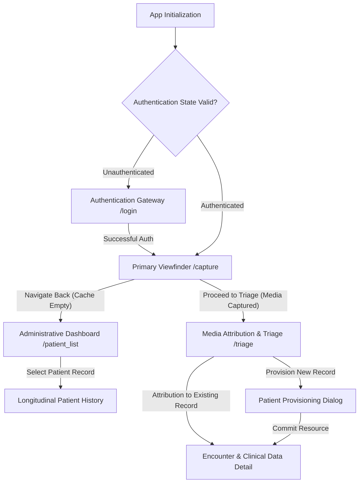

# Navigation Architecture & State Management

ChartCam's navigation framework is engineered around a deterministic, state-driven **"Snap-First"** architecture. This paradigm systematically prioritizes the core clinical action—high-fidelity photography—over administrative data entry (e.g., patient selection, encounter creation), significantly reducing cognitive load and interaction friction for practitioners in high-acuity environments.

## Architectural Flow Diagram

The application's routing logic is strictly governed by the authenticated user's state and the presence of ephemeral clinical media within the secure capture cache.

## Route Definitions

ChartCam utilizes type-safe routing arguments to enforce strict data contracts between UI destinations.

| Route Identifier | Semantic Purpose | Argument Payload |
| :--- | :--- | :--- |
| `login` | Authentication Entry & Token Negotiation | N/A |
| `capture` | High-Fidelity Camera Viewfinder | N/A |
| `triage/{paths}` | Attribution of Captured Media to FHIR Resources | `paths`: Serialized JSON array of encrypted, ephemeral file paths |
| `patient_list` | Administrative Dashboard & Roster | N/A |

## State Transition Decision Trees

The navigation controller enforces strict state transitions based on the following deterministic rules:

*   **Authentication Resolution (`Login Success`)**: Upon successful token negotiation, the navigation stack is cleared, and the user is forcefully routed to the `capture` destination, enforcing the "Snap-First" operational model.
*   **Viewfinder Egress (`Capture Back Navigation`)**:
    *   **Condition A (Uncommitted Media Present)**: If `photos_captured > 0`, the application intercepts the back navigation event and surfaces a mandatory confirmation dialogue ("Discard Unsaved Media?"). This safeguard prevents inadvertent data loss and ensures explicit user intent.
    *   **Condition B (Cache Empty)**: If `photos_captured == 0`, the navigation controller safely transitions the user to the `patient_list` destination, recognizing that the primary clinical action has concluded or was not initiated.
*   **Media Attribution (`Triage`)**:
    *   The `triage` destination functions as the critical integration bridge. It is responsible for associating the ephemeral, encrypted files captured in the viewfinder with persistent, structured `Patient` and `Encounter` models (often represented as FHIR resources). This association is a prerequisite for secure synchronization with the centralized clinical backend.
